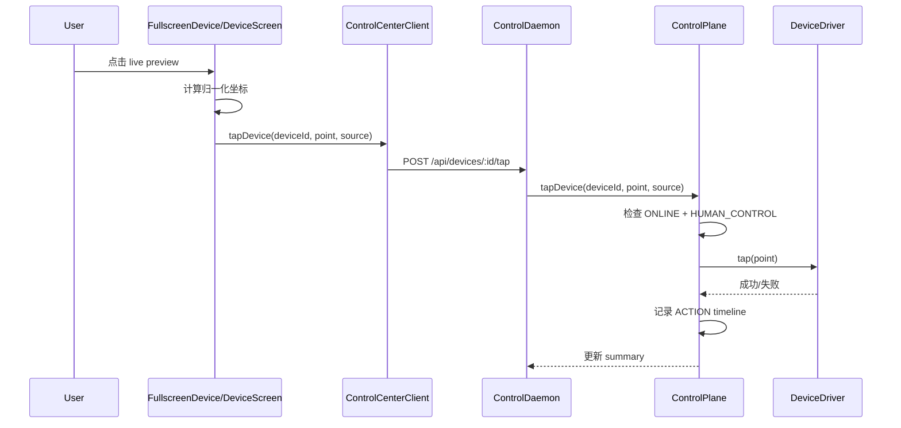

# OmniDeck 详细设计文档

更新时间：2026-08-13
文档定位：面向当前仓库实现状态的系统详细设计，覆盖多设备监控、AI 调度、人工接管与投屏可操控链路

## 1. 设计目标

本设计文档面向以下设计问题：

- 如何管理 8/16/32 台设备而不互相污染运行态
- 如何让 AI 与人工在同一设备上切换控制权
- 如何保证批量任务是“同目标、不同实例”
- 如何支持 1 台 Android + 2 台 iOS 的真机接入
- 如何在当前无实时视频网关的前提下实现可操控预览

## 2. 系统总览

### 2.1 顶层架构

```text
OmniDeck Desktop
   ├─ Device Wall
   ├─ Device Inspector
   ├─ Fullscreen Device View
   ├─ Task / Workspace / Group UI
   └─ ControlCenterClient
            │
            ├─ HTTP Commands / Snapshots
            └─ SSE Events
            │
      ControlDaemon
        ├─ DeviceManager
        ├─ SessionManager
        ├─ TaskScheduler
        ├─ ControlPlane
        ├─ DriverRegistry
        └─ EventStore
            │
            ├─ AndroidAdbScrcpyDriver
            ├─ IOSXCUITestDriver
            └─ SimulatedDeviceDriver
```

### 2.2 AI 观察与执行结构

```text
Screenshot ───────┐
UI Tree ──────────┼→ Observation
Action History ───┘
                        ↓
                 VLM / Grounding
                        ↓
                      Planner
                        ↓
                      Action
                        ↓
                   DeviceDriver
                        ↓
                      Device
                        ↓
                      Verify
```

当前代码已实现其中的：

- Screenshot 驱动的 observation 骨架
- Android UIAutomator hierarchy 解析与 selected-device 读取链路
- Device-scoped action
- 手工 tap / swipe / long press / input text / key / back / home / stop app
- Action 后的 UI hierarchy 验证与截图验证骨架
- Agent Step Trace：按设备记录 Observation / Plan / Execute / Verify / Approval 的 bounded 审计元数据
- Agent Artifact Store：按 device/task/step 记录 observation screenshot、post-action screenshot、UI summary、planner request/response、approval decision 的脱敏元数据
- Task Center baseline：提供全局轻量任务索引、selected-task audit drawer 与 WAITING_APPROVAL 审批入口
- AgentRunOrchestrator：按单设备 `TaskInstance` 驱动多步 Observation / Plan / Execute / Verify，并记录 task-local step、token、cost、latency 聚合指标
- Human Approval policy baseline
- 事件、日志与 timeline 的基础结构

尚未完整实现：

- Grounding service
- 复杂 planner 策略中心与 grounding provider
- 持久化 Token / Cost 报表与预算管理面

### 2.3 成熟方案参考结论

对照 scrcpy、STF/DeviceFarmer、Appium、Android UIAutomator、WebDriverAgent 与浏览器 WebCodecs 生态后，OmniDeck 的设计取舍应保持为“混合控制面”：

| 成熟方案 | 适合借鉴 | 不直接照搬的原因 | OmniDeck 设计取舍 |
| --- | --- | --- | --- |
| scrcpy | Android 低延迟投屏、键鼠控制、H.264 设备端编码 | 原生 scrcpy 面向单窗口/单设备交互，不负责 AI 调度、任务隔离、审计 | 复用 scrcpy-server/H.264 思路，但由 ControlDaemon 按 deviceId 管理视频会话 |
| STF / DeviceFarmer | 浏览器管理大量 Android 设备、远程控制、设备查询 | 偏通用设备农场，不包含每设备 AI Agent、VLM 成本控制、Human Approval | 借鉴设备墙和远程控制体验，但 runtime state 仍由 OmniDeck DeviceSession 管 |
| Appium UIAutomator2 / XCUITest | 语义定位、跨平台自动化、并行设备端口模型 | 32 台设备不能常驻 32 个重 Appium/WDA 会话 | 仅对 actively controlled / AI-running 设备按需创建平台会话，并由 WorkerPool 限流 |
| Android UIAutomator | 快速读取 XML hierarchy，适合 observation 和 action verification | XML 可能缺失 WebView/游戏/自绘 UI 语义 | 作为第一优先级 observation；失败时再进入截图/VLM grounding |
| WebCodecs / WebRTC | 浏览器侧低延迟解码、后续可扩展 fan-out | WebRTC/TURN 网关超出当前本地 MVP | 当前 WebSocket + WebCodecs；中期再引入 WebRTC 网关 |

参考资料：

- [Genymobile scrcpy](https://github.com/Genymobile/scrcpy)
- [DeviceFarmer STF](https://github.com/wandera/devicefarmer-stf)
- [Android UIAutomator command reference](https://android.googlesource.com/platform/frameworks/base/+/84bf8073a8a80cf464eba1dada0eb7585f9943d5/docs/html/tools/help/uiautomator/index.jd)
- [Appium UiAutomator2 Driver](https://appium.io/docs/en/latest/quickstart/uiauto2-driver/)
- [Appium XCUITest Parallel Tests](https://appium.github.io/appium-xcuitest-driver/latest/guides/parallel-tests/)
- [Appium XCUITest Capabilities](https://appium.github.io/appium-xcuitest-driver/7.35/reference/capabilities/)
- [WebDriverAgent](https://github.com/facebookarchive/WebDriverAgent)
- [MDN WebCodecs API](https://developer.mozilla.org/en-US/docs/Web/API/WebCodecs_API)

## 3. 关键设计原则

### 3.1 稳定会话

每台设备只允许存在一个稳定的 `DeviceSession`。

以下操作不得重建设备运行态对象：

- 切换 Device Wall 布局
- 单击设备
- 打开 Inspector
- 双击进入 Fullscreen
- ESC 退出 Fullscreen
- 前端运行时重同步

### 3.2 设备本地状态隔离

以下状态必须严格设备本地化：

- `AgentSession`
- `TaskContext`
- `ActionHistory`
- `Memory`
- `HealthState`
- `ScreenStream`
- `TaskQueue`
- `CurrentTask`

### 3.3 AI 与监控流分离

- 监控预览使用低带宽分层流策略
- AI 分析使用单独高分辨率截图
- 不允许将连续视频直接作为 AI 观察输入主链路

### 3.4 命令显式定向

所有设备动作必须显式携带：

- `commandId`
- `timestamp`
- `deviceId`

严禁隐式默认设备或多设备坐标广播。

## 4. 模块详细设计

### 4.1 DeviceManager

文件：`src/domain/deviceManager.ts`

职责：

- 创建稳定设备注册表
- 管理设备连接状态、基础信息、运行状态
- 维护 `DeviceSession` 聚合根
- 处理设备离线与恢复

输出对象：

- `DeviceSession`

注意点：

- `update()` 使用就地合并保持对象身份稳定
- `recover()` 不会默默重建 session，只更新状态字段

### 4.2 SessionManager

文件：`src/domain/sessionManager.ts`

职责：

- 根据布局、选中设备、全屏设备与可见设备集合，分配 stream profile
- 不拥有设备运行态，只修改流配置

### 4.3 TaskScheduler

文件：`src/domain/taskScheduler.ts`

职责：

- 批量目标展开为独立 `TaskInstance`
- 管理 worker queue
- 管理 AI / VLM / ADB / iOS 资源限制
- 管理 rate limit、retry、timeout 元数据

关键配置：

- `maxConcurrentAI = 8`
- `maxConcurrentVLM = 4`
- `maxConcurrentADB = 12`
- `maxConcurrentIOS = 4`

### 4.4 ControlPlane

文件：`src/domain/controlPlane.ts`

职责：

- 驱动单设备任务执行
- 处理 pause / resume / stop / retry
- 处理 human takeover / release
- 处理 offline / recover
- 处理预览 tap / swipe / wheel scroll / keyboard 输入
- 处理 Inspector 手工 Back / Home / Input Text / Long Press / Stop App
- Action 成功后对 Android 执行 UI hierarchy 再观察，并写入设备本地 ActionHistory

约束：

- 手工输入必须要求 `agentStatus === HUMAN_CONTROL`
- 手工输入按 deviceId 串行化，避免同一设备 tap / swipe / text 交错
- 输入文本仅记录 `redactedLength`，错误中的 `adb shell input text` 也必须脱敏

### 4.5 DriverRegistry

文件：`src/domain/deviceDriver.ts`

职责：

- 注册驱动实例
- 通过 `deviceId` 获取驱动
- 统一暴露 screenshot、monitorFrame、tap、swipe、longPress、inputText、pressKey、back、home、stopApp、getUiHierarchy 等操作
- 对 preview frame 做 device-local coalescing，避免同一设备并发拉帧放大压力

### 4.6 ControlDaemon

文件：`src/server/controlDaemon.ts`

职责：

- 持有唯一运行时 owner
- 提供 HTTP API 与 SSE 事件
- 提供命令幂等缓存
- 将前端命令委托给 `ControlPlane`
- 在真机模式下完成驱动绑定

### 4.7 useControlCenter

文件：`src/app/useControlCenter.ts`

职责：

- 获取 runtime snapshot
- 订阅 SSE
- 管理 layout / group / workspace / selection 等视图态
- 分发 stream policy 与 device action
- 提供 tap command 入口

约束：

- 不持有 live domain object
- 不构造 `DeviceManager` / `ControlPlane` / `DeviceSession`

## 5. 数据模型设计

### 5.1 DeviceSession 聚合

`DeviceSession` 内部包含：

- identity：`id`、`name`、`platform`
- runtime：`agentSession`、`agentRuntime`
- stream：`screenStream`、`stream`
- task：`currentTask`、`taskQueue`、`taskHistory`、`taskContext`
- telemetry：`metrics`、`healthState`
- audit：`actionHistory`
- state control：`sessionRevision`

### 5.2 DTO 边界设计

#### DeviceSummaryDTO

用于 Device Wall，特点：

- 轻量
- 无历史与上下文
- 可频繁更新

#### DeviceDetailDTO

用于 Inspector，特点：

- 仅按需拉取单设备
- 暴露 timeline / logs / task history / task context

这样可以避免 32 设备模式下挂载 32 份重数据视图。

## 6. 协议设计

### 6.1 传输模型

- 快照与命令：HTTP
- 增量事件：SSE

### 6.2 幂等模型

`ControlDaemon` 内部维护 `commandCache`：

- 若 `commandId` 首次出现，执行并缓存结果
- 若再次出现且请求签名一致，直接返回缓存结果
- 若再次出现但签名不同，返回 409 冲突

### 6.3 主要接口

#### 查询接口

- `GET /api/runtime`
- `GET /api/devices`
- `GET /api/devices/:deviceId`
- `GET /api/devices/discovery`
- `GET /api/events?since=N`
- `GET /api/devices/:deviceId/frame`
- `GET /api/devices/:deviceId/mjpeg`
- `GET /api/devices/:deviceId/wda-status`
- `GET /api/devices/:deviceId/ui-tree`

#### 低延迟流接口

- `WS /api/devices/:deviceId/video`

`/video` 当前用于 Android scrcpy-server H.264 包转发，浏览器通过 WebCodecs 解码；`/mjpeg` 用于 iOS/WDA 或 fallback。二者都只是监控/人工控制通道，不作为 AI 连续视频输入。

#### 命令接口

- `POST /api/tasks/batch`
- `POST /api/devices/configure`
- `POST /api/devices/:deviceId/connect`
- `POST /api/devices/:deviceId/pause`
- `POST /api/devices/:deviceId/resume`
- `POST /api/devices/:deviceId/stop`
- `POST /api/devices/:deviceId/retry`
- `POST /api/devices/:deviceId/take-control`
- `POST /api/devices/:deviceId/release-control`
- `POST /api/devices/:deviceId/disconnect`
- `POST /api/devices/:deviceId/recover`
- `POST /api/devices/:deviceId/restart-app`
- `POST /api/devices/:deviceId/launch-app`
- `POST /api/devices/:deviceId/stop-app`
- `POST /api/devices/:deviceId/tap`
- `POST /api/devices/:deviceId/scroll`
- `POST /api/devices/:deviceId/swipe`
- `POST /api/devices/:deviceId/long-press`
- `POST /api/devices/:deviceId/input-text`
- `POST /api/devices/:deviceId/press-key`
- `POST /api/devices/:deviceId/back`
- `POST /api/devices/:deviceId/home`
- `POST /api/session/stream-policy`

所有 POST 仍必须携带 `commandId`、`timestamp` 与显式 `deviceId`，且 URL `deviceId` 与 body `deviceId` 不一致时拒绝。`GET /api/runtime` 与 `DeviceSummaryDTO` 不允许携带 `uiTree`、完整 timeline 或日志。

## 7. Device Wall 与 UI 设计

### 7.1 Device Wall

Device Wall 是首页核心，而不是二级菜单功能。

现有实现支持：

- 1/4/8/9/16/25/32 布局
- Group 切换
- Workspace 切换
- 单选、多选、范围选
- Fullscreen 打开与 ESC 返回

### 7.2 Device Tile

每个 tile 展示：

- 预览画面
- Device Name
- Platform
- Online Status
- Agent Status
- Task Status
- FPS
- Battery
- Network

### 7.3 Device Inspector

当前实现已覆盖：

- Live View
- Take Over
- Pause / Resume / Retry
- Timeline
- Device Health
- Session Log
- Back / Home
- Swipe Up / Swipe Down
- Long Press test
- Input Text
- Load UI Tree
- iOS WDA diagnostics

待补完的产品能力：

- Screenshot history
- UI element selector-driven tap
- Human Approval panel
- Lock/Unlock

## 8. 流媒体与预览设计

### 8.1 流策略

当前流策略与产品要求一致，分为：

- Fullscreen
- Focused
- Preview
- Background

### 8.2 当前投屏实现边界

当前仓库采用分层预览：

- **Android**：`scrcpy-server` H.264 → WebSocket `/api/devices/:id/video` → 浏览器 WebCodecs + Canvas（低延迟主路径）
- **iOS**：优先反代 WDA 原生 MJPEG（约定 `wdaPort + 1000`，如 `8100 → 9100`）；不可达时回退到 daemon 截图 MJPEG
- 回退：`/frame` 轮询 + decode-before-swap 双缓冲
- 模拟设备：占位渲染

因此：

- “可操控”基于预览画面实现；Android 人工预览与 AI 截图路径分离（不连续把 H.264 交给 AI）
- 同一设备 preview frame 由 `DriverRegistry` 合并并缓存短时间窗口，避免并发请求导致设备端 screencap 压力放大
- Android H.264 preview 优先，失败时回退到 `/frame` 双缓冲截图；iOS 优先 MJPEG，失败时回退 daemon screenshot MJPEG
- 不应宣称已完成公网 WebRTC/TURN 网关
- 更低延迟演进：Android WebRTC zero-copy fan-out；iOS ScreenCaptureKit + WebRTC

### 8.3 成熟流媒体方案取舍

成熟设备农场通常把“监控视频”和“设备动作”拆成两条通道：视频链路追求低延迟和资源可控，动作链路追求审计和显式设备定向。OmniDeck 也应坚持这个拆分：

- Android：`scrcpy-server` 负责设备端编码，ControlDaemon 负责 device-scoped socket 生命周期，浏览器 WebCodecs 负责解码绘制。
- iOS：WDA/MJPEG 作为本地 MVP preview；更成熟的中期路线是独立采集进程 + WebRTC，而不是让 WDA screenshot 承担高 FPS 监控。
- 32 设备墙：只给可见 tile 分配 preview profile；selected/fullscreen 提升帧率；background 降到 0-1 FPS 或事件截图。
- AI：始终走 on-demand screenshot/UI tree，不订阅 preview H.264/MJPEG。

## 9. 人工接管与可操控设计

### 9.1 状态切换

当用户点击 `Take Over`：

1. 停止该设备 in-flight action
2. 释放 worker 占用
3. 将当前任务置为 `PAUSED`
4. 设备 agent 状态切换为 `HUMAN_CONTROL`

当用户点击 `Release Control`：

1. 保留当前设备真实 UI 状态
2. 若设备还有当前任务，则状态回到 `PAUSED`
3. 等待显式 Resume

### 9.2 点击操控链路



### 9.3 前端坐标投影

`DeviceScreen.projectPoint()` 处理：

- 图片在容器中的真实渲染尺寸
- `object-fit: contain` 带来的留白
- 坐标归一化
- 越界点击过滤

这保证了不同窗口大小下仍能正确映射到设备屏幕。

## 10. AI Loop 设计

### 10.1 当前执行模型

当前 `ControlPlane.execute()` 通过 `AgentRunOrchestrator` 驱动单设备多步 Agent Step Engine，核心顺序是：

1. 申请 AI / VLM / 平台资源，并遵守 `TaskScheduler` 并发限制
2. 通过 `StreamManager.requestAIScreenshot()` 获取高分辨率、按需截图
3. Android 读取 UIAutomator hierarchy，构造 device-local observation summary
4. `AgentPlannerProvider` 生成标准 `AgentAction`；默认 provider 为 deterministic/mock，可通过 env 切换 DeepSeek text planner
5. Zod schema 校验 action，拒绝 raw shell / 任意 command
6. Human Approval gate 判断敏感目标或 `request_human`
7. 执行 device-scoped driver action
8. Android 读取 UI hierarchy 作为 post-action verification
9. 再次截图，推进 task step 或 finish
10. 失败、超时、掉线按单设备 task 收尾，不影响 sibling device
11. 每步写入 device-local `AgentStepRecord`，只保存截图引用元数据和 UI summary，不保存截图二进制或完整 UI tree
12. 同步写入 in-memory `ArtifactStore`，按 `deviceId + taskInstanceId + stepId` 索引脱敏 artifact metadata
13. 在 `TaskInstance` 上累加 `maxSteps`、`completedSteps`、planner token usage、estimated cost 与 planner/action/verification latency；这些指标只进入 Task Center / selected-task audit，不进入 `/api/runtime` wall summary

实现后的真实闭环为：

`Observation -> Plan -> Validate Action -> Approval Gate -> Execute -> Verify -> Next Step / Finish`

当前默认 planner provider 仍是 deterministic/mock，用于本地无密钥开发和测试边界；DeepSeek provider 已作为 OpenAI-compatible text planner 接入，只替换 provider，不改变 ControlPlane/Driver 所有权。

DeepSeek 启用方式：

```bash
OMNIDECK_PLANNER_PROVIDER=deepseek
DEEPSEEK_API_KEY=sk-your-deepseek-key
DEEPSEEK_BASE_URL=https://api.deepseek.com
DEEPSEEK_MODEL=deepseek-v4-flash
```

约束：DeepSeek 只接收 device-local observation 摘要、UIAutomator actionable node 摘要、截图 metadata 和脱敏 action history；不接收 scrcpy/WDA 视频流、不接收截图二进制、不输出 ADB/WDA/shell 命令。模型输出必须通过 `AgentAction` Zod 白名单，且 `deviceId/taskInstanceId` 必须匹配当前单设备任务实例。

### 10.2 Observation 输入结构

从产品设计角度，完整 observation 理想输入应包含：

- device info
- screenshot
- uiTree
- currentApp
- task
- previousAction
- history

当前代码已具备：

- device summary
- on-demand AI screenshot metadata
- Android UIAutomator hierarchy summary
- task context
- bounded, redacted action history
- last planned action / pending approval，仅 selected-device agent-state/detail 可见
- recent step trace，仅 selected-device agent-state 可见，包含 before/after screenshot metadata、planner provider id、execution、verification 与 approval decision
- task trace / task artifacts，仅 selected-device selected-task 路由可见，包含 bounded step records 与脱敏 artifact 列表/summary
- global task summaries，通过 `/api/tasks` 暴露轻量任务索引，不包含 trace/artifacts payload/UI tree/screenshot binary
- task audit aggregation，通过 `/api/tasks/:taskId/audit` 或 device-scoped audit route 按需加载选中任务详情

待完善：

- grounding result
- model cost
- action selector confidence
- 持久化 artifact file store、截图内容脱敏/加密与 retention policy

### 10.4 Task Center 数据边界

当前 Task Center 是全局只读任务索引 + selected-task 审计面板，职责是运营检索和人工审批，不拥有设备 runtime state。

数据流：

```text
TaskCenter UI
  ├─ GET /api/tasks?status=&deviceId=&limit=&offset=
  └─ GET /api/tasks/:taskId/audit
        ↓
ControlDaemon
  └─ ControlPlane.listTasks / getTaskAudit
        ↓
DeviceSession currentTask / taskQueue / taskHistory + ArtifactStore
```

约束：

- `/api/tasks` 只返回 `TaskSummaryDTO`：task/device/status/stepCount/artifactCount/approvalStatus 等轻量字段
- `/api/tasks/:taskId/audit` 只在用户选中任务后加载 bounded trace 和 metadata artifacts
- device-scoped audit route 必须拒绝 device/task mismatch
- Task Center 审批仍调用既有 device/task approve/reject route，不能影响 sibling task
- 切换 Monitor Wall 与 Task Center 不调用 layout/session 构造逻辑，不改变 `sessionRevision`

### 10.3 Action 白名单

模型不应直接执行 shell。

系统层应将模型输出限制为标准 action schema，再交给 driver 执行。

当前代码已体现这一原则：

- `agentActionSchema` 白名单包含 `tap_element` / `tap` / `swipe` / `input_text` / `press_key` / `back` / `home` / `launch_app` / `wait` / `request_human` / `finish`
- `tap_element` 通过 UIAutomator selector 定位元素，找不到元素时失败，不 fallback 为固定坐标
- `input_text` 在 timeline、agent-state 和错误诊断中只记录 redacted length
- sensitive goal/action 会进入 `WAITING_APPROVAL`，不直接执行
- 所有动作都通过 `ControlPlane` 和 `DeviceDriver` 执行
- 前端/模型没有直接触碰 shell 的路径
- 手工动作和 Agent 动作共享同一套 device-scoped driver contract
- 批量任务必须扩展为 per-device `TaskInstance`，不能把一个坐标广播到多台设备

## 11. Android 驱动设计

### 11.1 技术边界

当前实现使用：

- ADB
- UIAutomator XML dump
- scrcpy-server H.264 preview
- `/frame` screencap fallback

未来可扩展：

- Appium/UIAutomator2
- Android Accessibility service / agent-side semantic bridge

### 11.2 已实现动作

- `connect`
- `screenshot`
- `monitorFrame`
- `getUiHierarchy`
- `getScreenSize`
- `tap`
- `swipe`
- `scrollWheel` fallback by short swipe
- `longPress`
- `inputText`
- `pressKey`
- `back`
- `home`
- `launchApp`
- `restartApp`
- `stopApp`
- `health`

### 11.3 tap 计算流程

Android 点击前执行：

1. `adb -s <serial> shell wm size`
2. `adb -s <serial> shell dumpsys input`
3. 解析分辨率与方向
4. 将归一化坐标换算为真实像素
5. `adb -s <serial> shell input tap X Y`

设计收益：

- 多设备并存时永远不会误用默认设备
- 横竖屏切换时坐标仍然可信

### 11.4 UIAutomator 观察链路

Android UI hierarchy 读取流程：

1. `adb -s <serial> exec-out uiautomator dump /dev/tty`
2. 解析 XML 中的 `node`、`text`、`resource-id`、`content-desc`、`class`、`bounds` 与状态字段
3. 若 `/dev/tty` 不返回有效 XML，fallback 到 `/sdcard/omnideck-ui-*.xml` 文件 dump + `exec-out cat`
4. 解析为轻量 `UiHierarchy`，只通过 `GET /api/devices/:deviceId/ui-tree` 暴露给 selected device
5. action 后记录 `UI_HIERARCHY_AFTER_ACTION`，用于审计和未来 planner 的 step verification

边界：

- UIAutomator 对 WebView、游戏、自绘 canvas、部分系统弹窗的语义覆盖有限。
- Agent 定位优先级应为：UI tree selector → accessibility/Appium selector → screenshot grounding → 低置信度时 request_human。
- UI tree 不进入 `DeviceSummaryDTO`，避免 32 tile 同时渲染/传输重对象。

### 11.5 文本与键盘输入

Android `input text` 的文本转义规则当前覆盖：

- 空白字符转为 `%s`
- shell 特殊字符加反斜杠
- CR/LF/TAB 归一为空格

审计规则：

- `ActionHistory` 只记录 `redactedLength=<n>`
- HTTP idempotency cache 只保存 command signature，不保存明文输入
- driver error 中的 `shell input text ...` 必须脱敏为 `[REDACTED_TEXT]`

## 12. iOS 驱动设计

### 12.1 技术边界

当前实现基于：

- WebDriverAgent
- XCUITest HTTP boundary

### 12.2 已实现动作

- `connect`
- `screenshot`
- `monitorFrame`
- `tap`
- `swipe`
- `scrollWheel`
- `longPress`
- `inputText`
- `pressKey`
- `back`（左缘 swipe 近似）
- `home`
- `launchApp`
- `restartApp`
- `stopApp`
- `health`

### 12.3 tap 计算流程

iOS 点击前执行：

1. `GET /window/size`
2. `GET /orientation`
3. 修正 viewport 宽高
4. 优先使用 `dragfromtoforduration(duration=0)` 作为 tap primitive，降低 WDA idle wait 卡住概率

设计收益：

- 每台设备绑定独立 WDA URL
- 不依赖全局 WDA 单例
- 能处理方向变化后的坐标换算

### 12.4 WDA readiness 与诊断

iOS 不把 WDA 当全局服务。每台 iPhone 维护独立：

- UDID
- WDA URL
- local port
- iproxy 检测结果
- `/status` readiness
- XCUITest session 状态
- signing/provisioning 错误分类

当前诊断状态包括：

- `UNCONFIGURED`
- `WDA_URL_ASSIGNED`
- `PORT_TUNNEL_MISSING`
- `WDA_NOT_RUNNING`
- `WDA_READY`
- `SESSION_CONNECTED`
- `SIGNING_REQUIRED`
- `UNKNOWN`

边界：

- 不自动安装 profile、信任证书、修改 Apple ID 或接受手机弹窗。
- WDA `/source` UI hierarchy 尚未接入；iOS `getUiHierarchy()` 当前明确返回 not implemented，不静默成功。

## 13. 多真机绑定设计

### 13.1 目标

支持至少：

- 1 台 Android
- 2 台 iOS

同时在线并接入同一 daemon。

### 13.2 配置方式

支持单设备兼容变量：

- `OMNIDECK_ANDROID_SERIAL`
- `OMNIDECK_IOS_UDID`
- `OMNIDECK_WDA_URL`

支持多设备变量：

- `OMNIDECK_ANDROID_SERIALS`
- `OMNIDECK_IOS_UDIDS`
- `OMNIDECK_WDA_URLS`

桌面开发入口：

- `npm run desktop:dev`：保持默认 simulated daemon，用于纯 UI/架构验证
- `npm run desktop:dev:android`：自动读取 `adb devices -l` 中已授权 Android serial，并以 `ANDROID_ADB_SCRCPY` driver 启动 Tauri desktop + ControlDaemon
- `npm run desktop:dev:android -- --serial=<android-serial>`：显式绑定单台 Android 真机，避免多机环境下误选

### 13.3 绑定逻辑

`resolveBindings()` 负责：

- 按平台选择可用 slot
- 校验 `deviceId` 与平台匹配
- 防止同一 slot 重复绑定
- 为未绑定设备保留 simulated driver

## 14. Health / Recovery 设计

### 14.1 健康维度

当前健康模型聚焦：

- device connected
- screen responsive
- app alive
- agent alive

未来可继续扩展：

- battery
- temperature
- WDA long-running stability
- scrcpy / stream health

### 14.2 异常恢复

异常处理原则：

- 中止该设备当前动作
- 标记当前任务为 `DEVICE_OFFLINE`
- 保留足够上下文供恢复
- 恢复后等待显式 resume

禁止：

- 静默重跑整条任务
- 无限重试

## 15. 审计与可观测设计

### 15.1 当前审计内容

`ControlPlane.record()` 当前已记录：

- task queued
- task resumed
- task stopped
- task failed
- human control started / released
- manual tap 百分比位置
- manual swipe / scroll / long press 百分比位置与 duration
- manual input text 的 redacted length
- press key / back / home
- app launch / restart
- stop app
- selected-device UI hierarchy 读取
- action 后 UI hierarchy verification 结果
- offline / recover

### 15.2 Agent Artifact Store

当前已增加内存态 `ArtifactStore`，它的职责是把 Agent Step Engine 的关键证据从 timeline 文本中拆出来，形成 selected-task 可查询的审计记录：

- `AI_OBSERVATION_SCREENSHOT`：AI 每步观察截图的 metadata 引用，不保存二进制
- `POST_ACTION_SCREENSHOT`：动作后验证截图的 metadata 引用，不保存二进制
- `UI_HIERARCHY_SUMMARY`：UIAutomator hierarchy 的 bounded summary，不返回完整树
- `PLANNER_REQUEST`：发送给 planner 的脱敏 observation 摘要
- `PLANNER_RESPONSE`：planner 返回的白名单 action 或错误摘要
- `APPROVAL_DECISION`：human approval / reject 决策记录

边界：

- artifact 按 `deviceId + taskInstanceId` 分桶，禁止跨设备/跨 task 查询污染
- `/api/runtime` 和 `DeviceSummaryDTO` 不包含 artifacts、step trace、完整 UI tree、planner payload 或截图二进制
- `/api/devices/:deviceId/tasks/:taskId/trace` 只返回目标 task 的 bounded step trace
- `/api/devices/:deviceId/tasks/:taskId/artifacts` 只返回目标 task 的 bounded artifact metadata 与 summary
- `/api/tasks` 只返回全局轻量 task summary，用于 Task Center 表格
- `/api/tasks/:taskId/audit` 和 `/api/devices/:deviceId/tasks/:taskId/audit` 只返回选中任务的 bounded trace/artifacts 聚合
- `input_text` 和包含 `adb shell input text` 的诊断字符串只保留长度或 `[REDACTED_TEXT]`

当前 store 仍是内存态，适合打通 Task Audit 基础闭环；后续需要补持久化目录、加密/脱敏策略、artifact retention、按任务检索与导出。

### 15.3 待扩展可观测项

根据产品设计，后续应补齐：

- confidence
- before/after screenshot linkage
- model response snapshot / raw provider payload 的合规留存策略
- token
- cost
- per-action latency breakdown

## 16. 安全设计

### 16.1 权限边界

- 真机模式默认关闭
- 操作必须显式 target device
- 高风险动作应走 approval policy

### 16.2 日志边界

- 不记录敏感凭据
- 不默认持久化未脱敏截图
- 不将模型直接暴露给 shell 执行能力

## 17. 测试与验收设计

### 17.1 自动化测试

当前测试覆盖：

- 会话 identity 稳定
- 状态隔离
- 批量任务独立实例
- 资源限制
- 掉线与恢复
- human takeover
- tap / swipe / long press / input text / key / back / home 仅在显式接管后允许
- 多真机绑定
- HTTP/SSE 幂等与事件重放
- Android ADB 命令必须包含 `-s <serial>`
- UIAutomator XML 解析与 fallback
- `DeviceSummaryDTO` 不包含 UI tree
- input text 不写入明文 ActionHistory / HTTP 错误
- iOS WDA readiness diagnostics
- scrcpy video packet parser / preview broadcast 基础测试
- Agent action schema 白名单与 raw command 拒绝
- deterministic/mock planner baseline
- selector-driven `tap_element` by text / resourceId / contentDesc
- Human Approval baseline：敏感 goal/action 进入 `WAITING_APPROVAL`，approve/reject 只影响目标 device/task
- Agent Step Trace：记录 observation / plan / execution / verification / approval decision，输入文本脱敏且截图只保留 metadata
- Planner Provider abstraction：非法 provider action 被 schema 拒绝，失败限定在目标 device/task
- selected-device `/agent-state`，wall summary 不包含 planner state / step trace / UI tree / full timeline
- Agent Artifact Store：按 device/task 隔离 artifacts，截图只存 metadata，文本输入脱敏
- selected-task `/trace` 与 `/artifacts` 路由：bounded 返回目标 task 审计数据，并拒绝 device/task mismatch
- Task Center：`/api/tasks` 轻量任务索引、`/audit` selected-task 聚合、WAITING_APPROVAL 过滤与审批 artifact 记录

### 17.2 当前验证命令

- `npm run lint`
- `npm test`
- `npm run build`
- `.agents/skills/omnideck-multi-device-control/scripts/validate_omnideck.sh`

### 17.3 产品级缺口

按产品 PRD 的 MVP 标准，当前仍缺：

- 8 台 Android 真机闭环验收
- 多款 Android ROM 文本输入稳定性验收
- 10 步动态 UI action 连续通过
- Human Approval 策略中心、审计面板和真实敏感动作人工确认验收
- grounding provider / VLM 接入
- AI cost / latency / token 统计
- 真实任务的 token / cost / latency 统计

## 18. 后续演进建议

### 18.0 Desktop Native Host

OmniDeck 已落地第一阶段 Tauri 2 桌面壳：React 仍负责 MonitorWall / DeviceInspector / TaskCenter，Rust native host 负责本机 ControlDaemon 进程守护入口。该阶段不迁移 `DeviceManager` / `ControlPlane` / `TaskScheduler`，避免破坏已建立的 device-local runtime state 边界。

当前桌面启动链路：

```text
Tauri 2 App
├── React UI
├── Rust NativeHost
│   ├── daemon_status
│   ├── start_control_daemon
│   ├── stop_control_daemon
│   └── read_control_daemon_logs
└── Node ControlDaemon sidecar/dev process
```

约束：Rust host 只管理本机 daemon 进程和日志尾部，不直接创建 `DeviceSession`，不发起设备动作，不绕过 HTTP/SSE command contract。后续迁移 ADB/scrcpy/iproxy 进程管理时，也必须保持 explicit deviceId、per-device driver binding、AbortSignal/timeout、日志脱敏和禁止坐标广播。

第一阶段之后，Rust native host 增加了 Device Process Supervisor MVP：

```text
Rust NativeHost
├── ProcessSupervisor
│   ├── DeviceProcessKey(deviceId, platform, processKind, identifier)
│   ├── Android SCRCPY process per deviceId + serial
│   └── iOS IPROXY process per deviceId + UDID
├── PortAllocator
│   └── stable WDA localPort per UDID, starting at 8100
└── device-scoped log ring buffers
```

新增 Tauri commands：

- `list_device_processes`
- `get_device_process`
- `start_android_scrcpy`
- `stop_android_scrcpy`
- `start_ios_iproxy`
- `stop_ios_iproxy`
- `allocate_ios_wda_port`
- `read_device_process_logs`

安全边界：React 不能传任意 shell command；Rust 只启动白名单工具 `scrcpy` / `iproxy`，参数以结构化 argv 传递，不拼接 shell 字符串。iOS signing/provisioning、Xcode profile、Apple ID、设备信任和手机弹窗仍必须由用户显式处理，native host 不自动处理。

前端展示边界：DeviceInspector 只为 selected device 加载 native process status 与 log tail；MonitorWall / DeviceTile / `/api/runtime` 不包含完整 native process logs。

新增命令：

- `npm run desktop:dev`：启动 Tauri 桌面开发壳
- `npm run desktop:dev:android`：启动 Tauri 桌面开发壳，并为本进程显式启用授权 Android 真机 driver
- `npm run desktop:check`：Rust native host 编译检查
- `npm run desktop:build`：Tauri 桌面构建入口
- `cargo test --manifest-path src-tauri/Cargo.toml`：Rust native host 单元测试

### 18.1 短期

- 增加 selector confidence 与候选可视化，辅助调试 `tap_element`
- 将当前内存态 artifact store 升级为持久化、加密/脱敏、可检索的 Task Audit store
- 增加 Task Center 独立视图
- 将 Human Approval baseline 扩展为可配置 policy、审批审计与按任务风险分级
- 增加一台 Android 真机 smoke 到 CI-friendly 手动脚本

### 18.2 中期

- 引入 WebRTC/MSE 视频网关
- 接入 AI Provider abstraction 与成本统计
- 完成 8 台 Android 真机验收
- iOS WDA `/source` adapter 与 selector action
- Appium UIAutomator2/XCUITest session pool，按 active task 创建并限流释放

### 18.3 长期

- 引入 Device Node
- 支持 64/128+ 设备分布式接入
- 将中央调度与边缘设备控制彻底解耦

## 19. 成熟方案映射到 OmniDeck 的落地原则

### 19.1 不做“单工具替代架构”

scrcpy、STF、Appium、WDA 都解决了局部问题，但 OmniDeck 的核心是多设备 AI 控制中心。因此不能让任一外部工具成为全局 runtime owner：

- 设备身份和状态归 `DeviceManager` / `DeviceSession`
- 动作生命周期归 `ControlPlane`
- 并发与资源归 `TaskScheduler` / `AgentWorkerPool`
- 投屏链路归 `StreamManager` / driver video session
- 平台工具只作为 device-local adapter

### 19.2 Android 推荐组合

P0/P1 推荐保持：

```text
ADB              -> connect / health / screenshot / shell input / app control
UIAutomator dump -> UI hierarchy observation / post-action verification
scrcpy-server    -> low-latency human preview
WebCodecs Canvas -> browser decode/render
```

P1 以后可增加：

- Appium UIAutomator2：用于 selector 更强的语义动作、WebView context、复杂表单。
- Accessibility bridge：用于高频 UI event 与更稳定的 semantic tree。
- WebRTC gateway：用于多客户端观看、远程节点和弱网重传。

### 19.3 iOS 推荐组合

P0/P1 推荐保持：

```text
xcrun devicectl / xcdevice -> discovery
iproxy                    -> device-local WDA tunnel
WebDriverAgent/XCUITest   -> session / screenshot / gestures / app control
MJPEG/screenshot fallback -> preview
```

P1 以后可增加：

- WDA `/source` -> iOS hierarchy adapter
- WDA MJPEG stability monitor -> preview health
- Appium capability profile -> unique `wdaLocalPort` / `mjpegServerPort` / session lifecycle
- macOS native capture process -> 更稳定 iOS 屏幕镜像，再通过 WebRTC 发布

### 19.4 多设备并发原则

成熟并行自动化方案通常要求每台设备拥有独立端口、独立 driver session、独立 app/session 状态。OmniDeck 在此基础上再加三层约束：

- 32 台在线不等于 32 个 AI/VLM/WDA/Appium session 常驻。
- 批量任务只共享 goal，不共享 mutable `TaskInstance` 或坐标。
- 真机动作必须有 explicit target、authorization、audit 和 idempotent command。

### 19.5 验收升级建议

后续每完成一项成熟方案集成，都应同时补齐以下证据：

- 单设备真实 smoke：connect -> take control -> action -> UI hierarchy -> ActionHistory。
- 多设备模拟 scale：8/16/32 session 不泄露 summary 重对象。
- 故障注入：一个设备离线、WDA reset、ADB timeout 不影响其他设备。
- 性能指标：FPS、latency、CPU、memory、queue depth、AI/VLM cost。
- 安全审计：输入明文、截图、UDID/serial 对外日志边界。
