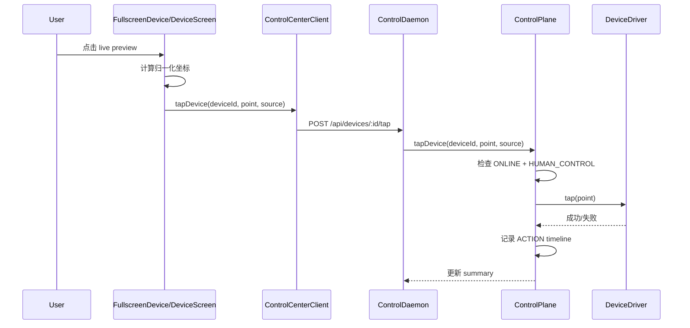

# OmniDeck 详细设计文档

更新时间：2026-08-12
文档定位：面向当前仓库实现状态的系统详细设计，覆盖多设备监控、AI 调度、人工接管与投屏可操控链路

## 1. 设计目标

本设计文档面向以下设计问题：

- 如何管理 8/16/32 台设备而不互相污染运行态
- 如何让 AI 与人工在同一设备上切换控制权
- 如何保证批量任务是“同目标、不同实例”
- 如何支持 1 台 Android + 2 台 iOS 的真机接入
- 如何在当前无实时视频网关的前提下实现可操控预览

## 2. 系统总览

### 2.1 顶层架构

```text
OmniDeck Desktop
   ├─ Device Wall
   ├─ Device Inspector
   ├─ Fullscreen Device View
   ├─ Task / Workspace / Group UI
   └─ ControlCenterClient
            │
            ├─ HTTP Commands / Snapshots
            └─ SSE Events
            │
      ControlDaemon
        ├─ DeviceManager
        ├─ SessionManager
        ├─ TaskScheduler
        ├─ ControlPlane
        ├─ DriverRegistry
        └─ EventStore
            │
            ├─ AndroidAdbScrcpyDriver
            ├─ IOSXCUITestDriver
            └─ SimulatedDeviceDriver
```

### 2.2 AI 观察与执行结构

```text
Screenshot ───────┐
UI Tree ──────────┼→ Observation
Action History ───┘
                        ↓
                 VLM / Grounding
                        ↓
                      Planner
                        ↓
                      Action
                        ↓
                   DeviceDriver
                        ↓
                      Device
                        ↓
                      Verify
```

当前代码已实现其中的：

- Screenshot 驱动的 observation 骨架
- Device-scoped action
- Verify 前后的截图流
- 事件、日志与 timeline 的基础结构

尚未完整实现：

- UI Tree 接入
- Grounding service
- Token / Cost 统计

## 3. 关键设计原则

### 3.1 稳定会话

每台设备只允许存在一个稳定的 `DeviceSession`。

以下操作不得重建设备运行态对象：

- 切换 Device Wall 布局
- 单击设备
- 打开 Inspector
- 双击进入 Fullscreen
- ESC 退出 Fullscreen
- 前端运行时重同步

### 3.2 设备本地状态隔离

以下状态必须严格设备本地化：

- `AgentSession`
- `TaskContext`
- `ActionHistory`
- `Memory`
- `HealthState`
- `ScreenStream`
- `TaskQueue`
- `CurrentTask`

### 3.3 AI 与监控流分离

- 监控预览使用低带宽分层流策略
- AI 分析使用单独高分辨率截图
- 不允许将连续视频直接作为 AI 观察输入主链路

### 3.4 命令显式定向

所有设备动作必须显式携带：

- `commandId`
- `timestamp`
- `deviceId`

严禁隐式默认设备或多设备坐标广播。

## 4. 模块详细设计

### 4.1 DeviceManager

文件：`src/domain/deviceManager.ts`

职责：

- 创建稳定设备注册表
- 管理设备连接状态、基础信息、运行状态
- 维护 `DeviceSession` 聚合根
- 处理设备离线与恢复

输出对象：

- `DeviceSession`

注意点：

- `update()` 使用就地合并保持对象身份稳定
- `recover()` 不会默默重建 session，只更新状态字段

### 4.2 SessionManager

文件：`src/domain/sessionManager.ts`

职责：

- 根据布局、选中设备、全屏设备与可见设备集合，分配 stream profile
- 不拥有设备运行态，只修改流配置

### 4.3 TaskScheduler

文件：`src/domain/taskScheduler.ts`

职责：

- 批量目标展开为独立 `TaskInstance`
- 管理 worker queue
- 管理 AI / VLM / ADB / iOS 资源限制
- 管理 rate limit、retry、timeout 元数据

关键配置：

- `maxConcurrentAI = 8`
- `maxConcurrentVLM = 4`
- `maxConcurrentADB = 12`
- `maxConcurrentIOS = 4`

### 4.4 ControlPlane

文件：`src/domain/controlPlane.ts`

职责：

- 驱动单设备任务执行
- 处理 pause / resume / stop / retry
- 处理 human takeover / release
- 处理 offline / recover
- 处理预览点击操控

### 4.5 DriverRegistry

文件：`src/domain/deviceDriver.ts`

职责：

- 注册驱动实例
- 通过 `deviceId` 获取驱动
- 统一暴露 screenshot、monitorFrame、tap 等操作

### 4.6 ControlDaemon

文件：`src/server/controlDaemon.ts`

职责：

- 持有唯一运行时 owner
- 提供 HTTP API 与 SSE 事件
- 提供命令幂等缓存
- 将前端命令委托给 `ControlPlane`
- 在真机模式下完成驱动绑定

### 4.7 useControlCenter

文件：`src/app/useControlCenter.ts`

职责：

- 获取 runtime snapshot
- 订阅 SSE
- 管理 layout / group / workspace / selection 等视图态
- 分发 stream policy 与 device action
- 提供 tap command 入口

约束：

- 不持有 live domain object
- 不构造 `DeviceManager` / `ControlPlane` / `DeviceSession`

## 5. 数据模型设计

### 5.1 DeviceSession 聚合

`DeviceSession` 内部包含：

- identity：`id`、`name`、`platform`
- runtime：`agentSession`、`agentRuntime`
- stream：`screenStream`、`stream`
- task：`currentTask`、`taskQueue`、`taskHistory`、`taskContext`
- telemetry：`metrics`、`healthState`
- audit：`actionHistory`
- state control：`sessionRevision`

### 5.2 DTO 边界设计

#### DeviceSummaryDTO

用于 Device Wall，特点：

- 轻量
- 无历史与上下文
- 可频繁更新

#### DeviceDetailDTO

用于 Inspector，特点：

- 仅按需拉取单设备
- 暴露 timeline / logs / task history / task context

这样可以避免 32 设备模式下挂载 32 份重数据视图。

## 6. 协议设计

### 6.1 传输模型

- 快照与命令：HTTP
- 增量事件：SSE

### 6.2 幂等模型

`ControlDaemon` 内部维护 `commandCache`：

- 若 `commandId` 首次出现，执行并缓存结果
- 若再次出现且请求签名一致，直接返回缓存结果
- 若再次出现但签名不同，返回 409 冲突

### 6.3 主要接口

#### 查询接口

- `GET /api/runtime`
- `GET /api/devices`
- `GET /api/devices/:deviceId`
- `GET /api/devices/discovery`
- `GET /api/events?since=N`
- `GET /api/devices/:deviceId/frame`

#### 命令接口

- `POST /api/tasks/batch`
- `POST /api/devices/configure`
- `POST /api/devices/:deviceId/connect`
- `POST /api/devices/:deviceId/pause`
- `POST /api/devices/:deviceId/resume`
- `POST /api/devices/:deviceId/stop`
- `POST /api/devices/:deviceId/retry`
- `POST /api/devices/:deviceId/take-control`
- `POST /api/devices/:deviceId/release-control`
- `POST /api/devices/:deviceId/disconnect`
- `POST /api/devices/:deviceId/recover`
- `POST /api/devices/:deviceId/restart-app`
- `POST /api/devices/:deviceId/launch-app`
- `POST /api/devices/:deviceId/tap`
- `POST /api/session/stream-policy`

## 7. Device Wall 与 UI 设计

### 7.1 Device Wall

Device Wall 是首页核心，而不是二级菜单功能。

现有实现支持：

- 1/4/8/9/16/25/32 布局
- Group 切换
- Workspace 切换
- 单选、多选、范围选
- Fullscreen 打开与 ESC 返回

### 7.2 Device Tile

每个 tile 展示：

- 预览画面
- Device Name
- Platform
- Online Status
- Agent Status
- Task Status
- FPS
- Battery
- Network

### 7.3 Device Inspector

当前实现已覆盖：

- Live View
- Take Over
- Pause / Resume / Retry
- Timeline
- Device Health
- Session Log

待补完的产品能力：

- Home / Back
- Screenshot
- 更完整 Device Control
- Lock/Unlock

## 8. 流媒体与预览设计

### 8.1 流策略

当前流策略与产品要求一致，分为：

- Fullscreen
- Focused
- Preview
- Background

### 8.2 当前投屏实现边界

当前仓库采用分层预览：

- **Android**：`scrcpy-server` H.264 → WebSocket `/api/devices/:id/video` → 浏览器 WebCodecs + Canvas（低延迟主路径）
- **iOS**：优先反代 WDA 原生 MJPEG（约定 `wdaPort + 1000`，如 `8100 → 9100`）；不可达时回退到 daemon 截图 MJPEG
- 回退：`/frame` 轮询 + decode-before-swap 双缓冲
- 模拟设备：占位渲染

因此：

- “可操控”基于预览画面实现；Android 人工预览与 AI 截图路径分离（不连续把 H.264 交给 AI）
- 不应宣称已完成公网 WebRTC/TURN 网关
- 更低延迟演进：Android WebRTC zero-copy fan-out；iOS ScreenCaptureKit + WebRTC

## 9. 人工接管与可操控设计

### 9.1 状态切换

当用户点击 `Take Over`：

1. 停止该设备 in-flight action
2. 释放 worker 占用
3. 将当前任务置为 `PAUSED`
4. 设备 agent 状态切换为 `HUMAN_CONTROL`

当用户点击 `Release Control`：

1. 保留当前设备真实 UI 状态
2. 若设备还有当前任务，则状态回到 `PAUSED`
3. 等待显式 Resume

### 9.2 点击操控链路



### 9.3 前端坐标投影

`DeviceScreen.projectPoint()` 处理：

- 图片在容器中的真实渲染尺寸
- `object-fit: contain` 带来的留白
- 坐标归一化
- 越界点击过滤

这保证了不同窗口大小下仍能正确映射到设备屏幕。

## 10. AI Loop 设计

### 10.1 当前执行模型

当前 `ControlPlane.execute()` 实现的核心顺序是：

1. 申请 AI / VLM / 平台资源
2. 获取高分辨率截图
3. 执行设备动作
4. 再次截图
5. 完成成功或失败收尾

这与产品期望的：

`Observation -> Next Best Action -> Execute -> Observation`

是一致的最小骨架。

### 10.2 Observation 输入结构

从产品设计角度，完整 observation 理想输入应包含：

- device info
- screenshot
- uiTree
- currentApp
- task
- previousAction
- history

当前代码已具备：

- device summary
- screenshot
- task context
- action history

待完善：

- uiTree
- grounding result
- model cost

### 10.3 Action 白名单

模型不应直接执行 shell。

系统层应将模型输出限制为标准 action schema，再交给 driver 执行。

当前代码已体现这一原则：

- 所有动作都通过 `ControlPlane` 和 `DeviceDriver` 执行
- 前端/模型没有直接触碰 shell 的路径

## 11. Android 驱动设计

### 11.1 技术边界

当前实现使用：

- ADB
- 可选 scrcpy 进程监督

未来可扩展：

- UIAutomator
- Appium/UIAutomator2

### 11.2 已实现动作

- `connect`
- `screenshot`
- `monitorFrame`
- `tap`
- `launchApp`
- `restartApp`
- `health`

### 11.3 tap 计算流程

Android 点击前执行：

1. `adb -s <serial> shell wm size`
2. `adb -s <serial> shell dumpsys input`
3. 解析分辨率与方向
4. 将归一化坐标换算为真实像素
5. `adb -s <serial> shell input tap X Y`

设计收益：

- 多设备并存时永远不会误用默认设备
- 横竖屏切换时坐标仍然可信

## 12. iOS 驱动设计

### 12.1 技术边界

当前实现基于：

- WebDriverAgent
- XCUITest HTTP boundary

### 12.2 已实现动作

- `connect`
- `screenshot`
- `monitorFrame`
- `tap`
- `launchApp`
- `restartApp`
- `health`

### 12.3 tap 计算流程

iOS 点击前执行：

1. `GET /window/size`
2. `GET /orientation`
3. 修正 viewport 宽高
4. `POST /wda/tap/0`

设计收益：

- 每台设备绑定独立 WDA URL
- 不依赖全局 WDA 单例
- 能处理方向变化后的坐标换算

## 13. 多真机绑定设计

### 13.1 目标

支持至少：

- 1 台 Android
- 2 台 iOS

同时在线并接入同一 daemon。

### 13.2 配置方式

支持单设备兼容变量：

- `OMNIDECK_ANDROID_SERIAL`
- `OMNIDECK_IOS_UDID`
- `OMNIDECK_WDA_URL`

支持多设备变量：

- `OMNIDECK_ANDROID_SERIALS`
- `OMNIDECK_IOS_UDIDS`
- `OMNIDECK_WDA_URLS`

### 13.3 绑定逻辑

`resolveBindings()` 负责：

- 按平台选择可用 slot
- 校验 `deviceId` 与平台匹配
- 防止同一 slot 重复绑定
- 为未绑定设备保留 simulated driver

## 14. Health / Recovery 设计

### 14.1 健康维度

当前健康模型聚焦：

- device connected
- screen responsive
- app alive
- agent alive

未来可继续扩展：

- battery
- temperature
- WDA long-running stability
- scrcpy / stream health

### 14.2 异常恢复

异常处理原则：

- 中止该设备当前动作
- 标记当前任务为 `DEVICE_OFFLINE`
- 保留足够上下文供恢复
- 恢复后等待显式 resume

禁止：

- 静默重跑整条任务
- 无限重试

## 15. 审计与可观测设计

### 15.1 当前审计内容

`ControlPlane.record()` 当前已记录：

- task queued
- task resumed
- task stopped
- task failed
- human control started / released
- manual tap 百分比位置
- app launch / restart
- offline / recover

### 15.2 待扩展可观测项

根据产品设计，后续应补齐：

- confidence
- before/after screenshot linkage
- model response snapshot
- token
- cost
- per-action latency breakdown

## 16. 安全设计

### 16.1 权限边界

- 真机模式默认关闭
- 操作必须显式 target device
- 高风险动作应走 approval policy

### 16.2 日志边界

- 不记录敏感凭据
- 不默认持久化未脱敏截图
- 不将模型直接暴露给 shell 执行能力

## 17. 测试与验收设计

### 17.1 自动化测试

当前测试覆盖：

- 会话 identity 稳定
- 状态隔离
- 批量任务独立实例
- 资源限制
- 掉线与恢复
- human takeover
- tap 仅在显式接管后允许
- 多真机绑定
- HTTP/SSE 幂等与事件重放

### 17.2 当前验证命令

- `npm run lint`
- `npm test`
- `npm run build`
- `.agents/skills/omnideck-multi-device-control/scripts/validate_omnideck.sh`

### 17.3 产品级缺口

按产品 PRD 的 MVP 标准，当前仍缺：

- 8 台 Android 真机闭环验收
- 文本输入稳定性验收
- 10 步动态 UI action 连续通过
- Human Approval 真实流程闭环

## 18. 后续演进建议

### 18.1 短期

- 补齐 swipe / input_text / long_press
- 增加 UI hierarchy 接入
- 增加 Task Center 独立视图
- 增加 Approval Policy

### 18.2 中期

- 引入 WebRTC/MSE 视频网关
- 接入 AI Provider abstraction 与成本统计
- 完成 8 台 Android 真机验收

### 18.3 长期

- 引入 Device Node
- 支持 64/128+ 设备分布式接入
- 将中央调度与边缘设备控制彻底解耦
